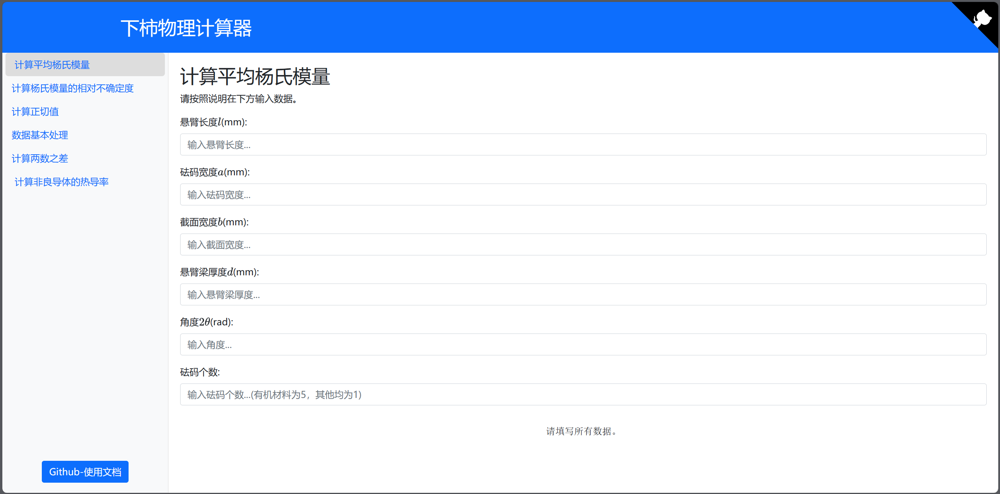

# 🔧 下柿物理实验计算器

## 🚀 介绍

立马尝试！👉[演示站点](https://phy.betterspace.top)

**完全免费开放**

## 已开放的实验计算：
1. 杨氏模量
2. 热导率
3. 转动惯量（未完全）

## 使用介绍
### 1.大物杨氏模量实验的数据处理

#### 💻 使用方法

    1. 这边建议的使用顺序为
    
    先计算悬臂梁的长度
    
    在程序里面已经内置了t因子，在计算时会分别给出乘以因子与未乘因子的结果
    
    再计算出正切值（程序会同步输出对应的2nθ）
    
    请按hn,xn的格式顺序输入
    
    再用origin绘图，得到2θ，以及不确定度
    
    最后将数据输入计算杨氏模量，以及计算其相对不确定度
    
    2. 该程序使用了放大数据的方法，以便更好地计算数值    
    
    因为计算最后杨氏模量不确定度的代码较为简单，因此编者认为可以交由使用者自行计算（不是懒
    
    3. 关于统计的程序，适用于计算数据的平均值，相对不确定度等，不止于该实验

    4.请务必注意输入的数据单位，（务必注意最后写在实验报告上的单位！！）统一为：
    
    长度毫米
    
    角度rad(在该程序中，计算出来的正切值即为rad)
    
    质量克，以及砝码的数量，只有有机玻璃是5个，其他的是1个
    
    关于重力加速度，在本程序中，已经内置为当时上课老师给的数据，使用者无需顾虑
    
    本程序也同时内置了各个物理量的不确定度（单位毫米或者克），使用者无需顾虑
    
    编者已经考虑了单位的转换，因此在计算平均杨氏模量的单位即为国际单位

### 2.大物热导率实验

    只提供计算热导率的程序，输入数据即可；

### 3.大物转动惯量实验
(**注意符号对应的数据输入的正确！！**)
    简直就是地狱般的计算，使用者需要注意输入数据时不要眼花缭乱即可(注意符号对应的数据输入的正确！！)
    本计算器只提供计算转动惯量和相对不确定度的计算，其余的过于简单或者可以使用统计程序进行计算故在此不再提供额外的功能，
    （根据规则保留有效数位后用计算器算应该还是比较简单的
    建议的使用顺序为：
    1. 先使用统计程序计算出各个平均值以及绝对不确定度(σ)
    2. 计算平均转动惯量以及其理论值
    3. 计算转动惯量的相对不确定度以及绝对不确定度

### 4.大物其余实验

    可以使用统计程序进行计算或过于简单，就不再提供额外程序

    注意实验时测量细心就可👌

## 注：
本实验计算适用于**2024年物理A1，A2实验**，务必注意
本人会持续更新各物理的数据处理程序，但顺序取决于本人的物理课实验安排，

目前在大物A1阶段只能提供杨氏模量的计算，到大物A2时也会进行更新，如果你也想为广大湖大学子解决物理实验数据的烦恼，并且有不同实验的数据处理程序，欢迎联系xiaoshengyidian😉😉😉

欢迎各位使用者对我的数据计算进行检验，若发现有任何不妥，请在issue中提出或者wx上反馈（😗😗😗）

最后，感谢 Yuzhong Zhang 的技术支持 ，没有他的支持，我们的项目就无法实现😊😊
## WARNING!!!!关于数据单位：🫵🫵🫵🫵

请务必注意输入的数据单位，（务必注意最后写在实验报告上的单位！！）

本计算器将输入与输出统一为实验纸上的单位，各位务必看仔细了

## 💡 贡献

欢迎提交 PR 和 Issue。

如果你有想法或需求，可以在 Issue 中提出。

也可以检查计算的结果是否有误！

如果你想为项目贡献代码，请在 PR 前创建 Issue。

# **最后祝大家的物理实验拿高分👌**

    

