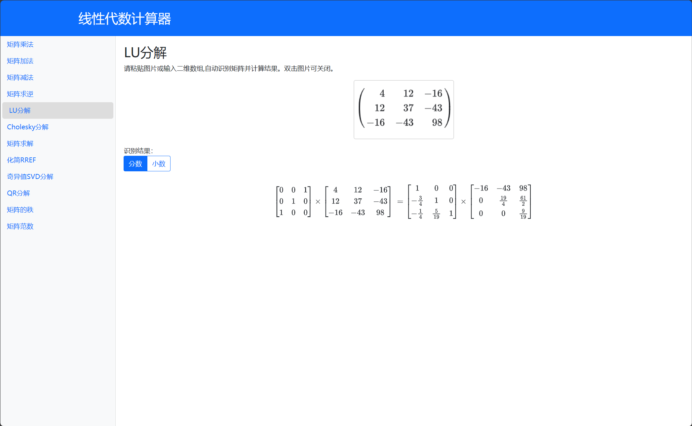

# 🔧 线性代数计算器



## 🚀 介绍

线性代数计算器是一个在线计算器，可以计算矩阵的行列式、逆矩阵、秩、特征值、特征向量、矩阵乘法等。

立马尝试！👉[演示站点](https://matrix.betterspace.top)

**完全免费开放**

## 💻 使用方法

### 自动识别

1. 截图需要计算的矩阵
2. 选择想要使用的计算方法
3. 粘贴截图

### 手动输入

1. 输入矩阵
    
    eg. 
    ```
    1 2 3
    4 5 6
    7 8 9
    ```
    ```
    1, 2, 3
    4, 5, 6
    7, 8, 9
    ```

2. 选择想要使用的计算方法后自动计算

## 💡 贡献

欢迎提交 PR 和 Issue。

如果你有想法或需求，可以在 Issue 中提出。

也可以检查计算的结果是否有误！

如果你想为项目贡献代码，请在 PR 前创建 Issue。


## 关于大物第二次实验的数据处理


## 0，WARNING!!!!关于数据单位：🫵🫵🫵🫵

请务必注意输入的数据单位，（务必注意最后写在实验报告上的单位！！）统一为：
    
长度毫米

角度rad(在该程序中，计算出来的正切值即为rad)

质量克


关于重力加速度，在本程序中，已经内置为当时上课老师给的数据，使用者无需顾虑

本程序也同时内置了各个物理量的不确定度（单位毫米或者克），使用者无需顾虑

编者已经考虑了单位的转换，因此在计算平均杨氏模量的单位即为国际单位

👌
    
1，这边建议的使用顺序为

先计算悬臂梁的长度

  在程序里面已经内置了t因子，在计算时会分别给出乘以因子与未乘因子的结果

再计算出正切值（程序会同步输出对应的2nθ）

  请按hn,xn的格式顺序输入

再用origin绘图，得到2θ，以及不确定度

最后将数据输入计算杨氏模量，以及计算其相对不确定度


2，该程序使用了放大数据的方法，以便更好地计算数值    

因为计算最后杨氏模量不确定度的代码较为简单，因此编者认为可以交由使用者自行计算（不是懒


欢迎各位使用者对我的数据计算进行检验，若发现有任何不妥，请在issue中提出或者wx上反馈（😗😗😗）
